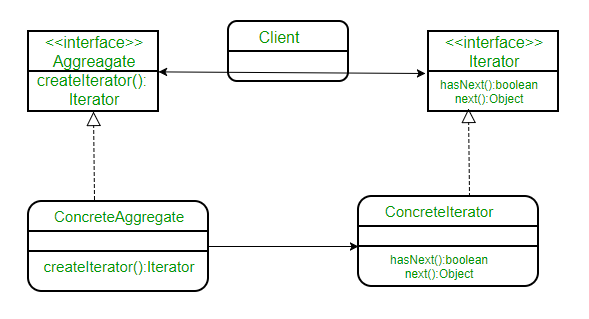

Iterator
============

Terminology:
------------

-  Iterator
-  Concrete Iterator
-  Container (Aggregate)
-  ConcreateContainer

Purpose
-------
Provide a way to access the elements of a collection object sequentially without exposing its underlying representation.
To make an object iterable and to make it appear like a collection of objects.

Examples
--------

-  to process a file line by line by just running over all lines (which
   have an object representation) for a file (which of course is an
   object, too)

UML Diagram
-----------

Test
----
Iterator_test.go
