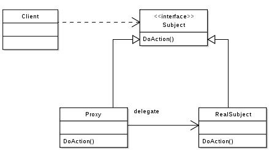

Proxy
=========
A class represents functionality of another class

A real world example can be a cheque or credit card is a proxy for what is in our bank account. It can be used in place of cash, and provides a means of accessing that cash when required. And that’s exactly what the Proxy pattern does – “Controls and manage access to the object they are protecting“.

Purpose
-------
- Proxy pattern is used when we need to create an object wrapper to cover the main object’s complexity from the client.
- Provide a new abstraction layer that is easy to work with, and can be changed easily 
- Represent an object that is complex or time consuming to create with a simpler one.

Examples
--------

-  Doctrine2 uses proxies to implement framework magic (e.g. lazy
   initialization) in them, while the user still works with his own
   entity classes and will never use nor touch the proxies

UML Diagram
-----------

Test
----

proxy_test.go
